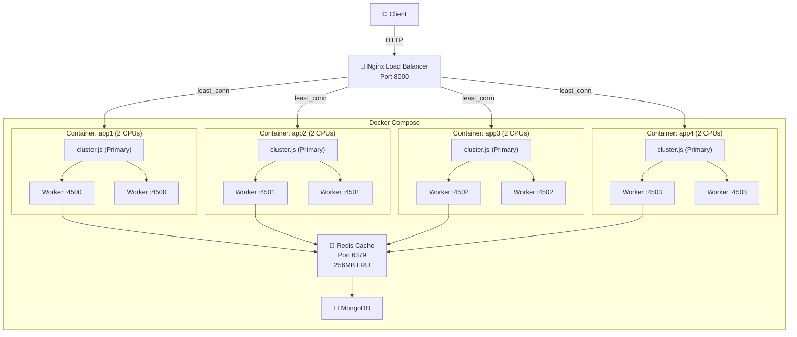
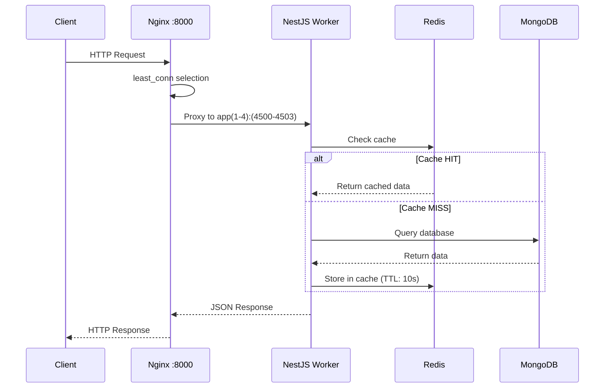
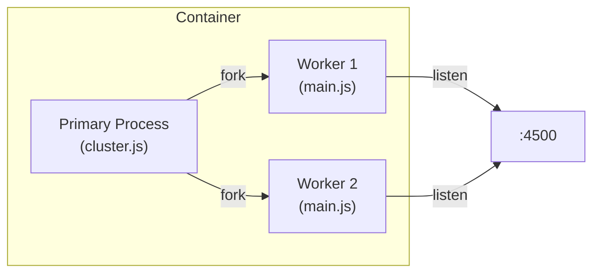
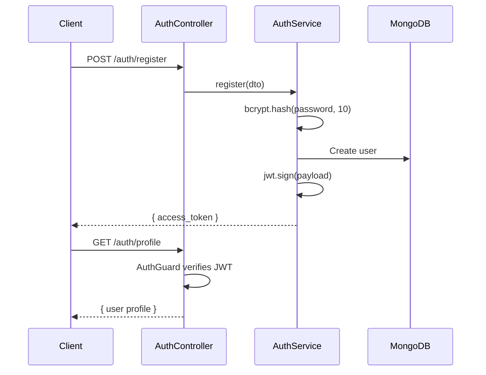

# 🚀 NestJS High-Performance Backend


A production-ready **NestJS** backend engineered for high throughput using **Nginx load balancing**, **Node.js clustering**, **Redis caching**, and **Docker containerization**. Built around a Course Management API with JWT authentication.

---

## ⚡ Architecture Overview



---

## 🔁 Request Flow



---

## 🧱 Three-Layer Optimization

### Layer 1: Node.js Clustering (`src/cluster.ts`)

Each Docker container runs `cluster.js` which forks one worker per CPU core. Workers share the same port via the OS kernel's load distribution.



- **Auto-respawn**: Dead workers are automatically replaced
- **CPU-bound scaling**: Utilizes all allocated CPU cores

### Layer 2: Nginx Load Balancer (`nginx.conf`)

| Setting | Value | Purpose |
|---|---|---|
| `least_conn` | — | Routes to the container with fewest active connections |
| `keepalive` | 64 | Reuses upstream TCP connections (reduces handshake overhead) |
| `worker_connections` | 65535 | Max concurrent connections per Nginx worker |
| `gzip` | level 5 | Compresses JSON, JS, CSS, XML responses |
| `proxy_buffering` | 16k + 4×32k | Buffers upstream responses for faster client delivery |

### Layer 3: Docker Resource Limits (`compose.yml`)

| Service | CPUs | Restart Policy | Dependencies |
|---|---|---|---|
| app1–app4 | 2 each | `unless-stopped` | Redis |
| Redis | — | `unless-stopped` | — |
| Nginx | — | `unless-stopped` | app1–app4 |

---

## 🛠️ Tech Stack

| Technology | Purpose |
|---|---|
| NestJS v11 | Backend framework |
| MongoDB + Mongoose v9 | Database + ODM |
| Redis 7 | Caching layer (LRU, 256MB) |
| Nginx | Reverse proxy + load balancer |
| Docker Compose | Container orchestration |
| Node.js Cluster | Multi-core utilization |
| JWT (`@nestjs/jwt`) | Token-based auth |
| bcrypt | Password hashing |
| class-validator | DTO validation |

---

## 📂 Project Structure

```
├── Dockerfile              # Multi-stage build → runs cluster.js
├── compose.yml             # 4 app containers + Redis + Nginx
├── nginx.conf              # Load balancer config
├── .dockerignore
├── .env                    # Environment variables
│
└── src/
    ├── cluster.ts          # Cluster primary → forks workers
    ├── main.ts             # NestJS bootstrap (worker entry)
    ├── app.module.ts       # Root module (Redis, Mongoose, Static)
    ├── app.controller.ts   # GET / → instance health check
    ├── app.service.ts
    │
    ├── auth/               # Authentication module
    │   ├── auth.controller.ts   # Register, Login, Profile
    │   ├── auth.service.ts      # JWT + bcrypt logic
    │   ├── auth.guard.ts        # Route protection
    │   └── dto/
    │       └── registerUser.dto.ts
    │
    ├── user/               # User module
    │   ├── user.service.ts
    │   └── schemas/
    │       └── user.schema.ts
    │
    └── course/             # Course module
        ├── course.controller.ts   # Full CRUD
        ├── course.service.ts
        ├── dto/
        │   ├── create-course.dto.ts
        │   └── update-course.dto.ts
        └── schemas/
            └── course.schema.ts
```

---

## 🚀 Getting Started

### Prerequisites

- **Docker Desktop** (with Compose v2)
- **Node.js** v20+ (for local development)
- **pnpm** (package manager)

### Environment Setup

Create a `.env` file in the project root:

```env
PORT=4500
MONGODB_URL=mongodb://your-mongodb-uri
JWT_SECRET=your-secret-key
```

### Run with Docker (Production)

```bash
# Build and start all services
docker compose up --build

# Access the API
curl http://localhost:8000
```

This starts **4 app containers** + **Redis** + **Nginx**, all wired together.

### Run Locally (Development)

```bash
pnpm install
pnpm start:dev      # Watch mode on port 4500
```

---

## 📡 API Endpoints

### 🔐 Authentication — `/auth`

| Method | Endpoint | Auth | Description |
|--------|----------|------|-------------|
| `POST` | `/auth/register` | ❌ | Register a new user |
| `POST` | `/auth/login` | ❌ | Log in and receive JWT |
| `GET` | `/auth/profile` | ✅ | Get authenticated user profile |

#### Register

```bash
curl -X POST http://localhost:8000/auth/register \
  -H "Content-Type: application/json" \
  -d '{"fname":"John","lname":"Doe","email":"john@example.com","password":"securepass123"}'
```

#### Login

```bash
curl -X POST http://localhost:8000/auth/login \
  -H "Content-Type: application/json" \
  -d '{"email":"john@example.com","password":"securepass123"}'
```

**Response:** `{ "access_token": "eyJhbGciOi..." }`

---

### 📚 Courses — `/course`

| Method | Endpoint | Auth | Description |
|--------|----------|------|-------------|
| `POST` | `/course` | ✅ | Create a course |
| `GET` | `/course` | ❌ | List all courses |
| `GET` | `/course/:id` | ❌ | Get course by ID |
| `PATCH` | `/course/:id` | ✅ | Update course (owner only) |
| `DELETE` | `/course/:id` | ✅ | Delete course (owner only) |

---

## 🔒 Authentication Flow



---

## � Benchmark Results

Tested with [autocannon](https://github.com/mcollina/autocannon) on Docker Desktop (Windows):

| Connections | Avg Req/s | P50 Latency | P99 Latency | Total Requests (30s) |
|---|---|---|---|---|
| 100 | 3,820 | 24ms | 54ms | 115k |
| 1,000 | 3,358 | 157ms | 1,710ms | 102k |
| 2,000 | 3,860 | 201ms | 5,186ms | 110k |

> **Note:** These numbers are on Docker Desktop (WSL2 VM). Expect **2–3x better** throughput on a native Linux server.

---

## 📜 Scripts

| Script | Description |
|--------|-------------|
| `pnpm start:dev` | Development with watch mode |
| `pnpm build` | Compile TypeScript |
| `pnpm start:prod` | Run compiled production build |
| `pnpm test` | Run unit tests |
| `pnpm test:e2e` | Run E2E tests |
| `pnpm lint` | Lint with ESLint |

---

## 📄 License

This project is [UNLICENSED](LICENSE).
